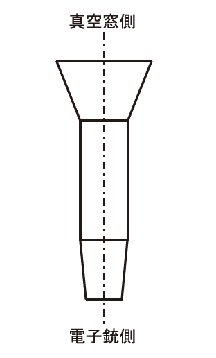

- [1. arXiv.2006.07392 Application of Mean Curvature Flow for surface parametrizations](#1-arxiv200607392-application-of-mean-curvature-flow-for-surface-parametrizations)
- [2. arXiv.1302.7054 Oblique-ECE Radial and Phase Detector of Rotating Magnetic Islands applied toAlignment and Phase-locked Modulation of ECCD for NTM Stabilization](#2-arxiv13027054-oblique-ece-radial-and-phase-detector-of-rotating-magnetic-islands-applied-toalignment-and-phase-locked-modulation-of-eccd-for-ntm-stabilization)
- [3. arXiv.1908.03795 Non-Adiabatic Effects on Electron Beam Quality for Frequency-TunableGyrotrons](#3-arxiv190803795-non-adiabatic-effects-on-electron-beam-quality-for-frequency-tunablegyrotrons)
- [4. arXiv.1001.0559 MASTERING THE ART OF THE SCHWARZ LEMMA](#4-arxiv10010559-mastering-the-art-of-the-schwarz-lemma)
- [5. arXiv.1005.0739 3D relativistic particle-in-cell hybridcode based on an exponential integrator](#5-arxiv10050739-3d-relativistic-particle-in-cell-hybridcode-based-on-an-exponential-integrator)
- [6. archive 047_AO-95-30](#6-archive-047_ao-95-30)
- [7. archive Experimental Study on Generation of a Higher Order Mode for W-band Gyrotron Oscillator.pdf](#7-archive-experimental-study-on-generation-of-a-higher-order-mode-for-w-band-gyrotron-oscillatorpdf)
- [8. archive Airbone Antenna using Geometrical theory of Diffraction and MoM.pdf](#8-archive-airbone-antenna-using-geometrical-theory-of-diffraction-and-mompdf)
- [9. archive Determination of Propagation contents.pdf](#9-archive-determination-of-propagation-contentspdf)
- [10. archive On the Theory of Corrugated Plane Surface.pdf](#10-archive-on-the-theory-of-corrugated-plane-surfacepdf)
- [11. archive RF wave simulation for cold edge plasmas using the MFEM library.pdf](#11-archive-rf-wave-simulation-for-cold-edge-plasmas-using-the-mfem-librarypdf)
- [12. archive Non-uniform Emission  Studies of a MagnetronInjection Gun.pdf](#12-archive-non-uniform-emission--studies-of-a-magnetroninjection-gunpdf)
- [13. archive PrincipleOfGyrotron.pdf](#13-archive-principleofgyrotronpdf)
  - [13.1. Cavity](#131-cavity)
  - [13.2. Oscilation of Gyrotron](#132-oscilation-of-gyrotron)
- [14. archive Stratton1946.pdf](#14-archive-stratton1946pdf)
- [15. archive Theory of Irregular Waveguides with slowy changing parameters.pdf](#15-archive-theory-of-irregular-waveguides-with-slowy-changing-parameterspdf)

## 1. arXiv.2006.07392 Application of Mean Curvature Flow for surface parametrizations

- <https://github.com/mkazhdan/ConformalizedMCF.git>

## 2. arXiv.1302.7054 Oblique-ECE Radial and Phase Detector of Rotating Magnetic Islands applied toAlignment and Phase-locked Modulation of ECCD for NTM Stabilization

## 3. arXiv.1908.03795 Non-Adiabatic Effects on Electron Beam Quality for Frequency-TunableGyrotrons

Non-Adiabatic Effects on Electron Beam Quality for Frequency-TunableGyrotrons

## 4. arXiv.1001.0559 MASTERING THE ART OF THE SCHWARZ LEMMA

tar.gx file is broken

## 5. arXiv.1005.0739 3D relativistic particle-in-cell hybridcode based on an exponential integrator

- <https://github.com/ALaDyn/piccante.git>
- <https://github.com/ricardo-fonseca/zpic.git>
- <https://github.com/TFDzarm/picFoam.git>

## 6. archive 047_AO-95-30

Precise recursive formula forcalculating spot size in optical waveguides and accurate evaluation of splice loss

Herimte-Gaussian

$$ f(x) = \Sigma_{i=0}^{\infty} C_i N_i H_i (\sqrt{2} \frac{x}{\omega} exp( -(\frac{x}{\omega})^2 )) $$

where
$$ \begin{aligned}
    C_i &= N_i \int_{-\infty}^{\infty} f(x) H_i(\sqrt{2}\frac{x}{\omega}) exp( -(\frac{x}{\omega})^2 )) \\
    N_i &= \frac{1}{(2^i i! \omega \sqrt{\frac{\pi}{2}} )^{1/2}}
\end{aligned} $$

$$ \begin{aligned}
    \omega^{(0)} &= \frac{4 \int x^2 f(x)^2 dx }{\int f(x)^2 dx}^{1/2} \\
    \omega^{(n+1)} &= \frac{4 \int x^2 exp( -(\frac{x}{\omega^{(n)}})^2 ) f(x) dx }{\int exp( -(\frac{x}{\omega^{(n)}})^2 ) f(x) dx}^{1/2} \\
\end{aligned} $$

## 7. archive Experimental Study on Generation of a Higher Order Mode for W-band Gyrotron Oscillator.pdf

## 8. archive Airbone Antenna using Geometrical theory of Diffraction and MoM.pdf

CHAPTER

- I INTRODUCTION
- II SUMMARY OF COMPUTER CODES
  - A. INTRODUCTION
  - B. AIRBORNE ANTENNA CODE
  - C. BASIC SCATTERING CODE
  - D. ELECTROMAGNETIC SURFACE PATCH CODE
- III P-3B L-BAND ANTENNA ANALYSIS
- IV A-7E UHF RELAY POD ANALYSIS
- V TRAFFIC ALERT AND COLLISION AVOIDANCE SYSTEM ANALYSIS
- VI SUMMARY   AND CONCLUSIONS

## 9. archive Determination of Propagation contents.pdf

## 10. archive On the Theory of Corrugated Plane Surface.pdf

## 11. archive RF wave simulation for cold edge plasmas using the MFEM library.pdf

## 12. archive Non-uniform Emission  Studies of a MagnetronInjection Gun.pdf

- <https://www.slac.stanford.edu/pubs/slacreports/>
- EGUN-AN ELECTRON OPTICS AND GUN DESIGN PROGRAM <https://www.slac.stanford.edu/pubs/slacreports/reports10/slac-r-331.pdf>

## 13. archive PrincipleOfGyrotron.pdf

- La Agusu, T. Idehara, H. Mori, T. Saito, I. Ogawa and S.Mitsudo, Int. J. Infrared Millim. Waves28, 315 (2007)
- T. Idehara and Y. Shimizu, Phys. Plasmas1, 3145 (1994).
- O. Dumbrajs, G.S. Nusinovich and A.B. Pavelyev, Int J.Electron.64, 137 (1988).
- G. S. Nusinovich, Int. J. Electron.51, 457 (1981).
- E. Borie and B. Jödicke, Int. J. Electron.72, 721 (1992).
- K. Kreischer, R.J. Temkin, H.R. Fetterman and W. Mulli-gan, IEEE Trans. Microw. Theory Tech.MTT-32, 481(1984).
- S.H. Gold and A.W. Fliflet, Int. J. Electron.72, 779 (1992)

### 13.1. Cavity

円筒の入口を狭くし，出口を広くテーパ状にしている．
入口を狭くすることにより，空胴で発振した電磁波は入口側でカットオフとなり，入口から電子銃側へは電磁波は進行できず，反射して出口側へ進むことになる．
出口側でも半径が変化することで波が一部反射し，閉空胴でないにもかかわらず，共振器となる

空胴で発振する電磁波の角振動数は，長さLの閉空胴の共振角振動数

$$ \omega = c \sqrt{\frac{\chi_{mp}^2}{R_c^2} + \frac{l^2\pi^2}{L^2}} $$

にほぼ等しい
つまり，ジャイロトロンの空胴はほとんどカットオフ条件で動作する

空胴内の電場構造f(z)は電子とのエネルギーの授受を考えない場合（冷たい空胴の近似

$$ \frac{d^2 f}{d z^2} + k_z^2 f = 0 $$

境界条件は，空胴入口でf=0，空胴出口で波が進行波($df/dz|z(out)=-ik_zf$)であることを課す

空胴のQ値は，本来は場の方程式を解くときにその固有値から決まる)の虚数部により決まるものであるが，簡単のため，解析的な式を用いて与えることが多い

Q値は，空胴内に蓄えられている電磁波のエネルギーWおよび損失電力Pにより$Q=\omega W/P$で定義される

空胴壁でのオーミック損からくる$Q_{ohm}$と回折損からくる$Q_{diff}$に分けられる

オーミック損$P_{Ohm}$は，空胴内の電磁波による壁に流れる電流と表皮効果の厚さ$\delta$で決まる

$$ Q_{ohm} = (R_c/\delta) [ (\chi_{mp}^2 - m^2) / \chi_{mp}^2 ] $$

回折損$P_{diff}$は，空胴内電磁波のエネルギーを，群速度$v_{gr}$で空胴長Lを移動する時間で割った程度である

$$ Q_{diff,min} = \omega L / v_{gr} = 4\pi (L/\lambda)^2 $$

実際は出口での反射による因子がかかり，$Q_{diff}$は$Q_{diff,min}$の２倍程度の値をとることが多い

### 13.2. Oscilation of Gyrotron

ジャイロトロンでの発振を，サイクロトロン放射の立場ではなく，空胴中において電場と相互作用する電子の運動を考え，電子の運動エネルギーの変化から検討することが通常行われている

$$ \frac{d \mathcal{E}}{dt} = -e v \cdot E $$  
$$ \frac{d p}{dt} = -e E - \frac{e}{cc} v x E $$  

変数を規格化する。$\gamma$は相対論的因子。

$$ u = \frac{2}{\beta_{\partial 0}^2} (1 - \frac{\gamma}{\gamma_0}) $$  
$$ \zeta = \pi \frac{\beta_{\partial 0}^2}{\beta_{\parallel 0}} (\frac{z}{\lambda}) $$  
$$ \mathcal{E} = m_e c^2 \gamma $$

弱い相対論的電子ビームに対して，電子の運動は次の２つの方程式で記述される。

$$ \frac{du}{d\zeta} = 2Ff(\zeta) (1-u)^{n/2} sin(\theta) $$  
$$ \frac{d\theta}{d\zeta} = \Delta - u - nFf(\zeta) (1-u)^{n/2-1} cos(\theta) $$  

2つ目の式の第2項($u = (2/\beta_{\partial 0}^2) (1 - \gamma/\gamma_0)$) は相対論効果による位相変化。
電子の垂直方向のエネルギーのうち、、電磁波のエネルギーへの変換効率は$\eta_{\perp}=u(\zeta_{out})$で計算できる。

$$ \eta = \frac{\gamma_0 - \gamma}{\gamma_0 - 1} = \frac{\beta_{\perp0}^2}{2(1-\gamma_0^{-1})^{\eta_{\perp}}} $$

Fは規格化された電場

$$ F = \frac{E_0}{B_0} \beta_{\partial 0}^{n-4} (\frac{n^{n-1}}{n!2^{n-1}} J_{m+-n} (k_{\partial}R_b)) $$  

$\theta=\omega t -n\phi$で定義され、時間に対してゆっくりと変化する(各振動数$\omega$, 電子の位相$\phi$)。

$$ \Delta = \frac{2}{\beta_{\perp0}^2} (1 - \frac{n\omega_{c0}}{\omega}) $$

空洞共振器入口でのサイクロトロン角振動数

$$ \omega_{c0} = e \frac{B_0}{m_e\gamma_0} $$

## 14. archive Stratton1946.pdf

- THEFIELDEQUATIONS
- MAXWELL'SEQUATIONS
  - 1.1 The Field Vectors
  - 1.2 Charge and Current
  - 1.3 Divergence of theFieldVectors
  - 1.4 Integral Form of the Field Equations
- MACROSCOPICPROPERTIESOFMATTER
  - 1.5 The Inductive Capacitiese and/x
  - 1.6 Electricand Magnetic Polarization
  - 1.7 Conducting Media
- UNITSANDDIMENSIONS
  - 1.8 M.K.S.orGiorgiSystem
- THEELECTROMAGNETICPOTENTIALS
  - 1.9 Vectorand Scalar Potentials
  - 1.10 Conducting Media
  - 1.11 HertzVectors,or Polarization Potentials
  - 1.12 Complex Field Vectors and Potentials
- BOUNDARYCONDITIONS
  - 1.13 Discontinuities in the Field Vectors
- COORDINATESYSTEMS
  - 1.14 Unitary and Reciprocal Vectors
  - 1.15 Differential Operators
  - 1.16 Orthogonal Systems
  - 1.17 Field Equations in General Orthogonal Coordinates
  - 1.18 Properties of Some Elementary Systems
- THEFIELDTENSORS
  - 1.19 Orthogonal Transformations and Their Invariants
  - 1.20 ElementsofTensorAnalysis
  - 1.21 Space-timeSymmetryoftheFieldEquations
  - 1.22 TheLorentzTransformation
  - 1.23 TransformationoftheFieldVectorstoMovingSystems
- STRESS AND ENERGY
- STRESS AND STRAIN IN ELASTIC MEDIA
  - 2.1 ElasticStressTensor
  - 2.2 AnalysisofStrain
  - 2.3 ElasticEnergyandtheRelationsofStresstoStrain
- ELECTROMAGNETICFORCESONCHARGESANDCURRENTS
  - 2.4 DefinitionoftheVectorsEandB
  - 2.5 ElectromagneticStressTensorinFreeSpace
  - 2.6 ElectromagneticMomentum
- ELECTROSTATICENERGY
  - 2.7 ElectrostaticEnergyasaFunctionofChargeDensity
  - 2.8 ElectrostaticEnergyasaFunctionofFieldIntensity
  - 2.9 ATheoremonVectorFields
  - 2.10 EnergyofaDielectricBodyinanElectrostaticField
  - 2.11 Thomson'sTheorem
  - 2.12 Earnshaw'sTheorem
  - 2.13 TheoremontheEnergyofUnchargedConductors
- MAGNETOSTATTCENERGY
  - 2.14 MagneticEnergyofStationaryCurrents
  - 2.15 MagneticEnergyasaFunctionofFieldIntensity
  - 2.16 FerromagneticMaterials
  - 2.17 EnergyofaMagneticBodyinaMagnetostaticField
  - 2.18 PotentialEnergyofaPermanentMagnet
- ENERGYFLOW
  - 2.19 Poynting'sTheorem
  - 2.20 ComplexPoyntingVector
- FORCESONADIELECTRICINANELECTROSTATICFIELD
  - 2.21 BodyForcesinFluids
  - 2.22 BodyForcesinSolids
  - 2.23 TheStressTensor
  - 2.24 SurfacesofDiscontinuity
  - 2.25 Electrostriction
  - 2.26 ForceonaBodyImmersedinaFluid
- FORCESINTHEMAGNETOSTATICFIELD
  - 2.27 NonferromagneticMaterials
  - 2.28 FerromagneticMaterials
- FORCESINTHEELECTROMAGNETICFIELD
  - 2.29 ForceonaBodyImmersedinaFluid
- CHAPTERIIITHEELECTROSTATICFIELDGENERALPROPERTIESOPANELECTROSTATICFIELD
  - 3.1 EquationsofFieldandPotential
  - 3.2 BoundaryConditions

## 15. archive Theory of Irregular Waveguides with slowy changing parameters.pdf

Table of Contents

- U.S. Board on Geographic Names Transliteration System
- Chapter I. Method of Small Heterogeneities
  - p.35 (40)
- Chapter II. Method of Cross Sections
  - p.74 (79)
- Chapter III. Critical Sections. Resonance Frequencies
  - p.166 (171)
- Chapter IV. Rectilinear Irregular Waveguides
  - p.228 (233)
- Chapter V. Bent Waveguides
  - p.316 (321)
- References
  - p.398 (402)
